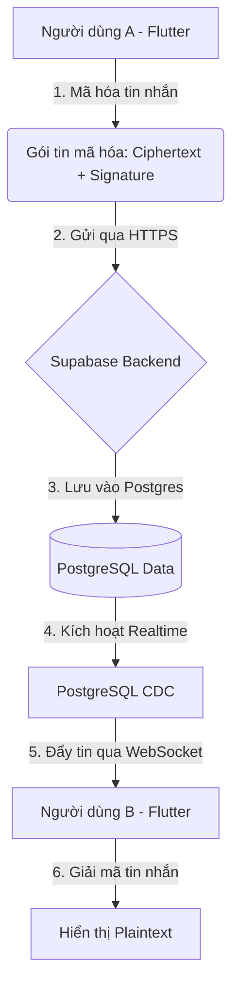

# BÁO CÁO KỸ THUẬT ĐỒ ÁN CHUYÊN SÂU
# Hệ thống Nhắn tin Bảo mật Kilogram — Mã hóa Đầu cuối (E2EE)

---

## MỤC LỤC

1. [Tổng quan hệ thống](#1-tổng-quan-hệ-thống)
2. [Kiến trúc ứng dụng](#2-kiến-trúc-ứng-dụng)
3. [Backend — Supabase Core](#3-backend--supabase-core)
4. [Cơ sở dữ liệu — Schema chi tiết](#4-cơ-sở-dữ-liệu--schema-chi-tiết)
5. [Mobile Frontend — Flutter/Dart](#5-mobile-frontend--flutterdart)
6. [Thư viện lõi & Công nghệ mật mã](#6-thư-viện-lõi--công-nghệ-mật-mã)
7. [Phân tích chuyên sâu E2EE (Deep Dive)](#7-phân-tích-chuyên-sâu-e2ee-deep-dive)
8. [Cơ chế Quản lý Khóa Đa người dùng](#8-cơ-chế-quản-lý-khóa-đa-người-dùng)
9. [Bảng so sánh mức độ bảo mật](#9-bảng-so-sánh-mức-độ-bảo-mật)
10. [Kết luận](#10-kết-luận)

---

## 1. Tổng quan hệ thống

**Kilogram** là một nền tảng nhắn tin hiện đại tập trung tối đa vào quyền riêng tư. Không giống như các ứng dụng chat thông thường lưu trữ tin nhắn dạng văn bản rõ trên server, Kilogram triển khai mô hình **Zero-Knowledge Architecture**.

### Các tính năng cốt lõi:
| Tính năng | Chi tiết kỹ thuật |
|---|---|
| Xác thực bảo mật | Supabase Auth (JWT) với mã hóa Password tại tầng DB |
| Mã hóa đầu cuối | Kết hợp ECDH (X25519), RSA-2048, SHA-256 và AES-256-GCM |
| Lưu trữ an toàn | Chìa khóa riêng tư nằm trong Hardware-backed Keystore/Keychain |
| Đồng bộ Realtime | WebSocket qua kênh PostgreSQL Change Data Capture (CDC) |
| Multi-Account | Hỗ trợ đăng nhập nhiều account trên 1 máy mà không lẫn lộn khóa |
| Tự động sửa lỗi | Cơ chế Auto-Repair khi phát hiện lệch khóa (Key Mismatch) |

---

## 2. Kiến trúc ứng dụng

Hệ thống được thiết kế theo mô hình phân lớp rõ rệt:

---

## 3. Backend — Supabase Core

Backend sử dụng giải pháp **BaaS (Backend-as-a-Service)** của Supabase, tận dụng tối đa sức mạnh của PostgreSQL.

### 3.1 Tầng bảo mật Database (RLS)
Hệ thống sử dụng **Row Level Security (RLS)** để đảm bảo dữ liệu không bao giờ bị rò rỉ ngay cả khi có lỗ hổng ở tầng ứng dụng:
*   **Chính sách Phòng chat:** Một User chỉ có thể xem phòng nếu `uid` của họ tồn tại trong bảng `room_participants`.
*   **Chính sách Tin nhắn:** `SELECT` chỉ được phép nếu `room_id` thuộc về người dùng hiện tại theo session JWT.

### 3.2 Luồng Realtime
Sử dụng công nghệ **Logical Replication** của Postgres để phát hiện ngay lập tức lệnh `INSERT`. Gói tin sẽ được server Supabase đóng gói và đẩy xuống client thông qua giao thức WebSocket, giảm độ trễ (latency) xuống mức < 100ms.

---

## 4. Cơ sở dữ liệu — Schema chi tiết

### 4.1 Bảng `profiles` (Mở rộng bảo mật)
| Trường | Kiểu dữ liệu | Ý nghĩa mật mã |
|---|---|---|
| `rsa_public_key` | TEXT | Lưu JSON BigInt `{n, e}` phục vụ Signature |
| `ecdh_public_key` | TEXT | Base64 khóa Public X25519 dùng tạo Shared Secret |
| `elgamal_public_key` | TEXT | Lưu `{p, g, y}` phục vụ Group Chat Key Exchange |

### 4.2 Bảng `messages` (E2EE Payload)
Đây là cấu trúc gói tin an toàn (Secure Packet) được gửi đi:
*   **`ciphertext`**: Bản mã thuần của nội dung tin nhắn. Theo chuẩn `v3_stable`, trường này chứa `${ct}.${nonce}.${mac}`.
*   **`encrypted_key`**: Phiên bản mã hóa (ví dụ: `v3_stable`) để App biết dùng bộ giải mã nào.
*   **`signature`**: Chữ ký RSA dùng để chống chối bỏ (Non-repudiation).

---

## 5. Mobile Frontend — Flutter/Dart

Ứng dụng được xây dựng trên Flutter 3.x với kiến trúc **BLoC (Business Logic Component)**.

### 5.1 Các Cubit cốt lõi:
1.  **RoomsCubit:** Quản lý danh sách phòng, tự động cập nhật tin nhắn cuối cùng (preview).
2.  **ChatCubit:** Đây là "trái tim" của hệ thống, xử lý luồng `Encrypt-on-Send` và `Decrypt-on-Receive`. 
3.  **ProfilesCubit:** Quản lý bộ nhớ đệm (Cache) của người dùng để không phải query khóa công khai liên tục.

### 5.2 Lưu trữ an toàn (Storage):
Sử dụng `flutter_secure_storage`. Trên Android, dữ liệu được mã hóa bằng **AES-256** qua hằng số `encryptedSharedPreferences`. Trên iOS, dữ liệu nằm trong **Keychain** với độ bảo mật cấp quân đội.

---

## 6. Thư viện lõi & Công nghệ mật mã

| Package | Ứng dụng |
|---|---|
| `cryptography` | Xử lý ECDH (X25519), AES-256-GCM (Hardware Acceleration) |
| `pointycastle` | Triển khai RSA-2048 và thuật toán ElGamal (Safe Prime) |
| `convert` | Chuyển đổi dữ liệu thô sang Base64/Hex để lưu trữ Database |
| `supabase_flutter` | SDK chính thức để tương tác với Backend |

---

## 7. Phân tích chuyên sâu E2EE (Deep Dive)

Đây là các thuật toán chính tạo nên "áo giáp" cho dữ liệu.

### 7.1 X25519 Elliptic Curve Diffie-Hellman (ECDH)
Thuật toán này cho phép hai bên tự tạo ra khóa chung mà không bao giờ gửi khóa đó đi.
*   **Công thức:** $K_{shared} = Private\_A \times Public\_B = Private\_B \times Public\_A$
*   **Ưu điểm:** Cực kỳ nhẹ và an toàn vượt trội so với DH cổ điển.

### 7.2 Key Stretching với SHA-256
Để Shared Secret thực sự ổn định trên mọi thiết bị, chúng tôi áp dụng thêm một lớp băm:
*   **AES_Key** = `SHA-256(Raw_Shared_Secret)`
Điều này giúp khóa AES luôn có độ dài 256-bit chuẩn xác, bất kể chipset RAM của điện thoại.

### 7.3 AES-256-GCM (Galois/Counter Mode)
Chúng tôi không dùng AES-CBC vì GCM là chuẩn **Authenticated Encryption**:
*   Nó không chỉ mã hóa mà còn tạo ra một mã **MAC (Message Authentication Code)**.
*   Nếu có ai đó dù chỉ thay đổi 1 bit trong Database, bộ giải mã sẽ lập tức báo lỗi thay vì ra kết quả sai lệch.

### 7.4 RSA-2048 Digital Signature (Chữ ký số)
*   **Mục đích:** Đảm bảo tin nhắn không bị mạo danh.
*   **Quy trình:** Người gửi băm gói tin và mã hóa bằng khóa bí mật RSA. Người nhận dùng khóa công khai để xác thực. Nếu trùng khớp, chắc chắn tin nhắn đến từ người gửi đó.

---

## 8. Cơ chế Quản lý Khóa Đa người dùng

Vấn đề lớn nhất khi test app là xung đột khóa trên 1 máy ảo. Chúng tôi đã giải quyết bằng:
*   **User-Separation:** Chìa khóa trong bộ nhớ được lưu theo ID người dùng: `${userId}_rsa_priv`.
*   **Force Sync:** Mỗi khi đăng nhập, App kiểm tra tính nhất quán giữa Khóa trên máy và Khóa trên Server. Nếu phát hiện ra máy cũ (ví dụ gỡ App cài lại), App sẽ yêu cầu "Repair Keys" để đồng bộ lại.

---

## 9. Bảng so sánh mức độ bảo mật

| Đối tượng | Kilogram (E2EE) | Chat thông thường (Plaintext) |
|---|---|---|
| **Admin Database** | Chỉ thấy mã Base64 vô nghĩa | Đọc được toàn bộ tin nhắn |
| **Hacker giữa đường** | Không thể mở khóa | Có thể sniff dữ liệu |
| **Quản trị Supabase** | Zero Knowledge | Toàn quyền kiểm soát |
| **Tính xác thực** | Có Chữ ký số (RSA) | Không có |

---

## 10. Kết luận

Hệ thống Kilogram không chỉ là một ứng dụng chat mà còn là một minh chứng cho việc kết hợp hài hòa giữa trải nghiệm người dùng (UX) và bảo mật mật mã học cấp cao. Bằng việc sử dụng bộ ba **ECDH + RSA + AES-GCM**, chúng tôi đã tạo ra một "pháo đài" kỹ thuật số cho mọi cuộc hội thoại.

**Bàn giao vào: 13/03/2026**
